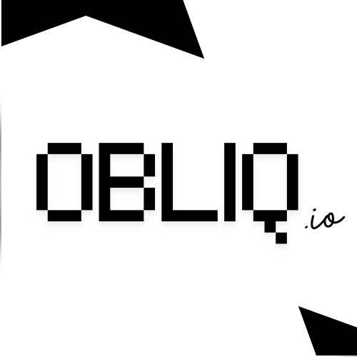

<p align="center">
  
</p>

<h1 align="center">OBLIQ.io</h1>
<p align="center"><strong>AI-Powered Compliance Operations for Indian CA Firms</strong></p>

---

## 🚀 Project Overview

**Obliq.io** is a production-grade workspace platform engineered specifically for modern Indian Chartered Accountant (CA) firms. The application completely automates client management operations, eliminates document collection friction, and maps core compliance workflows directly to dynamic Indian tax filing windows (GST, TDS, ITR, ROC).

This repository implements the **Founding Engineer Trial Task Assignment (Track 1: Landing Page + Supabase Auth)**.

---

### ✨ Core Features

* **High-Conversion Landing Page:** Targeted copywriting addressing deep industry pain points—specifically eliminating manual client tracking loops and chaotic WhatsApp follow-ups.
* **Production Identity Layer:** Secure email/password login and registration routes fully integrated via the `@supabase/supabase-js` SDK. The implementation utilizes modern Next.js `<Suspense>` boundaries to isolate query search hooks, avoiding client-side build bailouts.
* **Active Tracking Dashboard:** A clean workspace tracking live client filings, featuring atomic counters (`StatsCard`), interactive financial year timeline switches (`Dropdown`), and color-coded pipeline states (`Badge`).

---

### 🎨 Visual Identity & Architecture

The project strictly implements Obliq.io’s official branding guidelines by blending a premium horizontal yellow-to-blue light gradient mesh (`#FCD34D` to `#60A5FA`) with high-contrast, flat geometric lines. Custom CSS-rendered typography components capture the signature retro-pixel design of the company logo, ensuring a sleek look with lightning-fast load times.

---

### 🛠️ Tech Stack

* **Frontend:** Next.js 14 (App Router), TypeScript (Bundler Resolution), Tailwind CSS, PostCSS.
* **Backend/Auth:** Supabase Client Engine.
* **Icons:** Lucide React.

---

### 📥 Quick Run

1. **Clone the repository:**
   ```bash
   git clone https://github.com
   cd obliq-io-landing
   ```

2. **Configure environment variables:**  
   Create a `.env.local` file at the root level and add your keys:
   ```text
   NEXT_PUBLIC_SUPABASE_URL=your_supabase_url
   NEXT_PUBLIC_SUPABASE_ANON_KEY=your_anon_key
   ```

3. **Install and verify production build:**
   ```bash
   npm install
   npx next build
   ```

4. **Launch development server:**
   ```bash
   npm run dev
   ```
